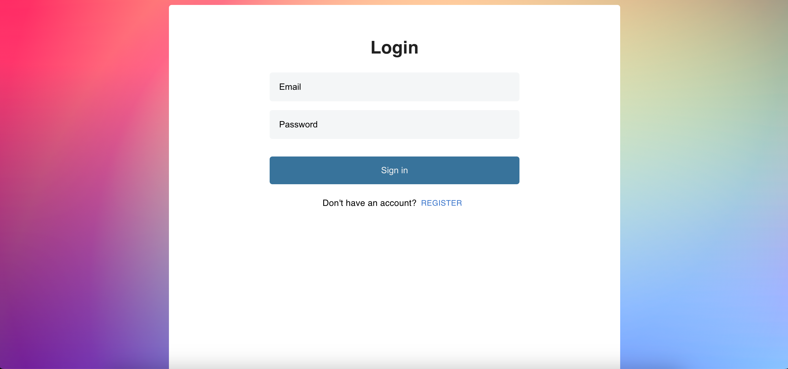

# Todo Application

Application to maintain a todo-list and it's CRUD operations

## Technology used

Material UI, React JS, AppWrite

## Features

- Add todo
- Add tasks to the todo
- Update todo
- Mark todo as completed
- Delete todo
- Search todo
- User authentication

## To run the application

- Clone the project  
  `https://github.com/KavyaMVG/todo-app-frontend.git`

- Install dependencies  
  `npm install`  

  Install and configure `appwrite` in local. This will involve installing `docker`

- Run the project  
  `npm start`

## Author

### Development

Want to contribute? Great!

To fix a bug or enhance an existing module, follow these steps:

- Fork the repo
- Make the appropriate changes in the files
- Commit your changes (`git commit -m 'Message goes here'`)
- Push to the branch (`git push`)
- Create a Pull Request

### Bug / Feature Request

If you find a bug or to request a new feature, kindly open an issue [here](https://github.com/KavyaMVG/Chat-app-frontend/issues/new).
